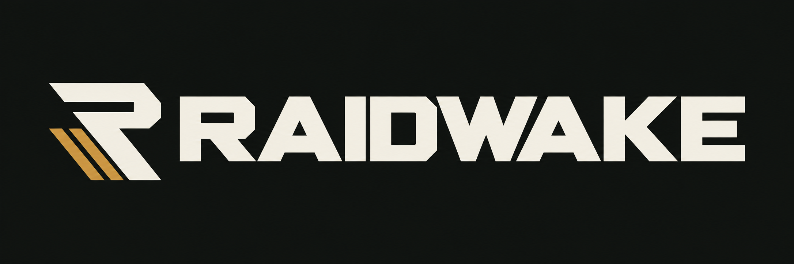

Single-player PvE for Escape from Tarkov, with local progression and configurable raids.

[Releases](https://github.com/RAIDWAKE/RAIDWAKE-Releases/releases) · [Report a bug](https://github.com/RAIDWAKE/RAIDWAKE-Releases/issues)

## Why RAIDWAKE?

RAIDWAKE brings raid customization into the game itself. Adjust the settings,
choose your character and play. The focus is on built-in features and a consistent
interface across the launcher and game.

- **Raid settings:** set raid length, AI difficulty, bot limits and loot for each
  map. Use shared defaults where you want them and map-specific overrides where
  you don't.
- **Boss controls:** adjust spawn chances and enabled maps, with character
  previews and visible default values.
- **Local characters:** manage profiles in the launcher, with edition-based
  starting gear or a Zero to Hero start.
- **Simulated flea market:** changing offers, simulated sellers and local sales.
  This is not a shared market between players.

These features are being tested in the development build. Co-op and a shared
community market are not currently available.

## Availability

RAIDWAKE is in development. A public playable build is not available yet.

Requires Windows and an installed copy of Escape from Tarkov. The current
development build targets EFT **1.1.5.47510**. RAIDWAKE uses a separate game copy;
game files are not included in downloads.

## Origins

RAIDWAKE builds on [SPT](https://github.com/sp-tarkov) through
[Single Player Tushonka](https://github.com/SP-Tushonka), an SPT-derived community
project. Its [server](https://github.com/SP-Tushonka/server-csharp) and
[client modules](https://github.com/SP-Tushonka/modules) provide the foundation
for the current runtime.

RAIDWAKE adds its own launcher, in-game raid controls, profile workflow and market
changes on top of that foundation. The goal is a customizable PvE game with these
features included together, while giving the upstream projects credit for their work.

The server is licensed under
[CC BY-NC-SA 4.0](https://github.com/SP-Tushonka/server-csharp/blob/6e10ae5f1b807181e78255671a64d41de00374bd/LICENSE);
the client modules use the
[NCSA license](https://github.com/SP-Tushonka/modules/blob/c2ceee4b17d053c84fe32d91da6c087798f0c44c/LICENSE.md).
Third-party code retains its licenses and attribution.

RAIDWAKE is not affiliated with or endorsed by Battlestate Games, SPT or Single
Player Tushonka. Escape from Tarkov belongs to Battlestate Games.
